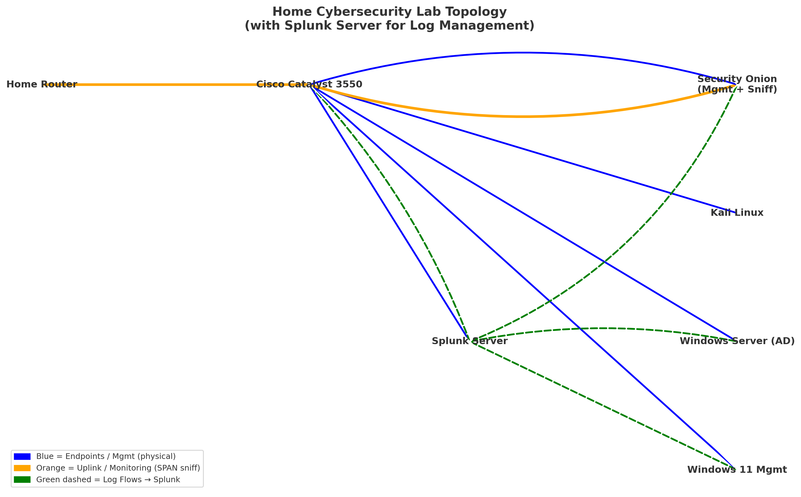

# Bare-Metal-Home-Cybersecurity-Lab
# Home Cybersecurity Lab

This repository documents my **Home Cybersecurity Lab**, designed to simulate an enterprise environment for both **Blue Team (defensive)** and **Red Team (offensive)** training.

## Overview

The lab replicates a small enterprise network using a Cisco Catalyst switch, multiple endpoints, and security monitoring tools. It provides a platform for learning:

- Active Directory administration
- Security monitoring with Security Onion
- Log aggregation and correlation with Splunk
- Red Team / penetration testing with Kali Linux
- Network monitoring using SPAN/mirroring on Cisco hardware

## Topology

## Devices and Roles

- **Cisco Catalyst 3550**  
  Acts as managed switch with SPAN configured to mirror traffic.

- **Security Onion (dual NICs)**  
  - Mgmt NIC: Admin access (192.168.1.10)  
  - Sniff NIC: Monitors mirrored traffic, running Zeek & Suricata.

- **Splunk Server**  
  Central log aggregator. Ingests logs from:
  - Windows Server (AD/DNS/DHCP)
  - Windows 11 Management workstation
  - Security Onion (via HEC/syslog)
  - Cisco Catalyst (syslog)

- **Windows Server 2019 (AD)**  
  Domain Controller with DNS/DHCP.

- **Windows 11 Management Device**  
  Domain-joined workstation for simulation.

- **Kali Linux**  
  Red Team penetration testing.

- **Home Router**  
  Gateway to internet for updates & external connectivity.

## Configuration Highlights

- **SPAN on Cisco 3550**  
  Mirrors Fa0/1 (uplink) and access ports (Fa0/2–Fa0/4) to Fa0/5 → Security Onion sniff NIC.

- **Security Onion**  
  Configured with Zeek, Suricata, and syslog forwarding to Splunk.

- **Splunk**  
  - Receives logs on ports 9997 (UFs), 8088 (HEC), and 514 (syslog).
  - Dashboards for Windows events, DNS queries, and Zeek/Suricata alerts.

- **Windows Server AD**  
  Provides authentication, DNS, and DHCP services.

## Use Cases

- Simulating attacks with Kali and detecting with Security Onion.  
- Correlating Security Onion IDS alerts with Splunk log data.  
- Practicing AD administration and monitoring.  
- Building detection rules, dashboards, and playbooks.  
